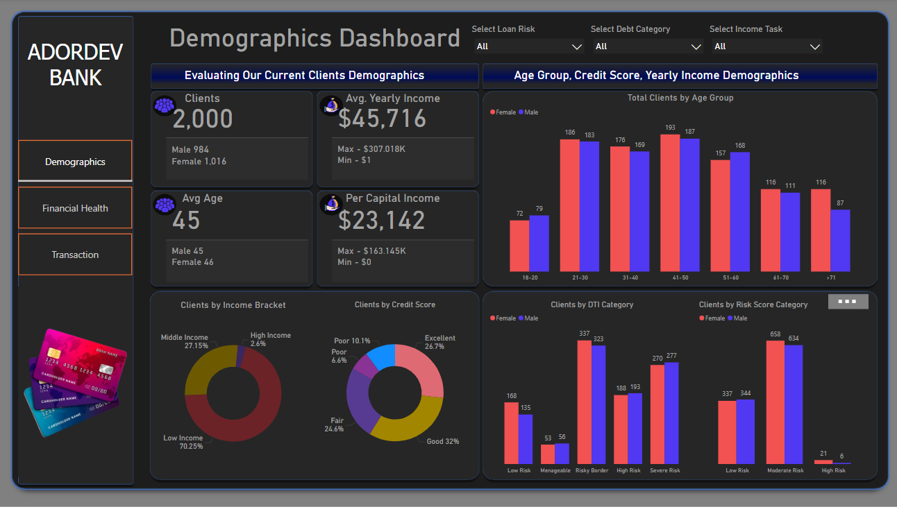
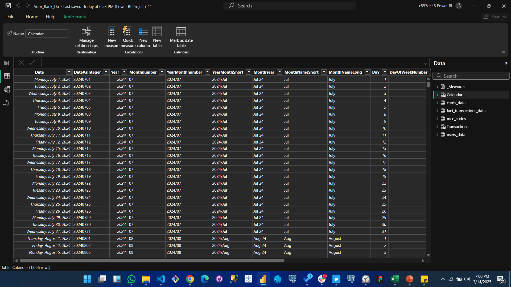
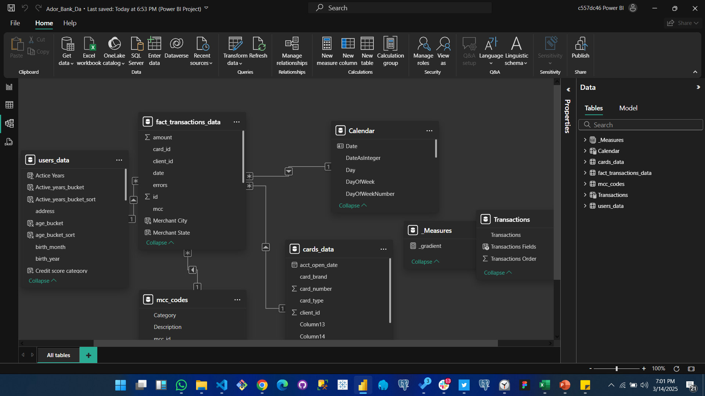
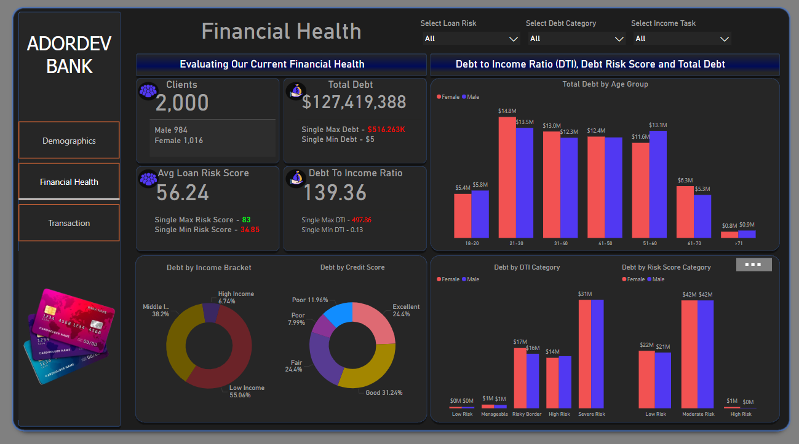
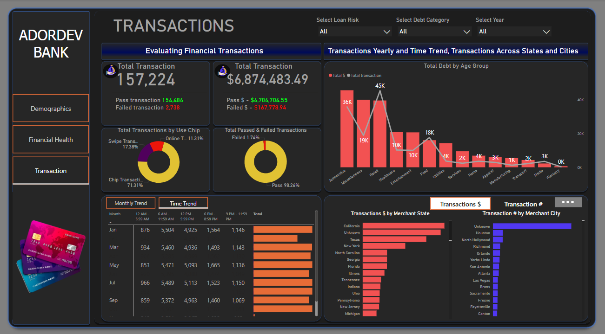

# AdorDev Bank Data Analysis Documentation

## 1. Title
**Analyzing AdorDev Bank’s Client Demographics and Financial Health**

  

---

## 2. Introduction
This project analyzes AdorDev Bank’s client data to evaluate financial health and transaction patterns. As part of my preparation for the IU Scholarship in Data Analysis, I explored this dataset to uncover insights into client demographics, debt profiles, and transaction behaviors. Using Power BI, I created dashboards to visualize key metrics, aiming to provide actionable recommendations for the bank to improve client financial management and operational efficiency.

---

## 3. About the Data
The dataset is sourced from AdorDev Bank and includes information on 2,000 clients, capturing their demographics (age, gender, income), financial health (debt, credit scores), and transaction history. The data spans multiple dimensions, such as debt-to-income (DTI) ratios, loan risk scores, and transaction amounts across various states. The goal is to assess the bank’s client base and identify areas for financial improvement.

---

## 4. Methodology

### Data Collection
The data was provided by AdorDev Bank in a structured CSV format, containing client records, financial metrics, and transaction logs. No external data sources were used.

### Data Cleaning & Transformation
- **Steps**:
  - Removed duplicate entries (e.g., duplicate client IDs).
  - Handled missing values by imputing averages for numerical fields like debt (e.g., filled missing DTI with the median).
  - Standardized categorical data (e.g., unified "Male" and "M" into a single category).
  - Created calculated columns, such as DTI categories (Low, Moderate, High) using DAX in Power BI.
- **Tools Used**: Power BI’s Query Editor for transformations.

  
*Alt Text*: Power BI Query Editor showing the steps for removing duplicates and imputing missing values.

### Exploratory Data Analysis (EDA)
- Analyzed distributions of key metrics (e.g., age, debt, transactions).
- Identified correlations, such as between credit scores and debt levels.
- Segmented data by demographics (e.g., age groups, gender) and financial categories (e.g., DTI brackets).

### Visualisation
- Used Power BI to create dashboards with charts like histograms (debt by age group), pie charts (income brackets), and bar charts (transactions by state).
- Applied filters for interactivity (e.g., loan risk, debt category).

### Statistical Analysis
- Calculated averages (e.g., average loan risk score: 56.24, average age: 45).
- Performed segmentation analysis to compare metrics across groups (e.g., debt by gender: females at $514.23K vs. males at $813.16K).
- Used DAX to compute aggregated metrics like total debt ($127,419,388).

### Interpretation & Recommendations
- Interpreted trends (e.g., younger clients have higher DTI ratios).
- Provided recommendations based on insights (e.g., target financial education for high-risk groups).

---

## 5. Data Structure Image
 
  
*Alt Text*: Diagram showing the dataset structure with tables (clients, transactions) and columns (client_id, age, debt_amount, transaction_amount).

---

## 6. Data Model Overview
The data model in Power BI consists of two main tables:
- **Clients Table**: Contains demographic and financial data (client_id, age, gender, income, debt, credit_score, DTI).
- **Transactions Table**: Logs transaction details (transaction_id, client_id, amount, date, state).
- **Relationships**: A one-to-many relationship links the Clients table (client_id) to the Transactions table (client_id), enabling cross-table analysis.

  
*Alt Text*: Power BI data model view showing the relationship between Clients and Transactions tables with a one-to-many link on client_id.

---

## 7. Analysis
- **Demographics**: 2,000 clients, 984 males, 1,016 females, average age of 45.
- **Financial Health**: Total debt is $127,419,388, with an average loan risk score of 56.24. Debt-to-income ratios show 139.3% average DTI, indicating high debt burden.
- **Transactions**: Total transaction amount is $6,874,483.49, with 45K transactions yearly.
- **Segmented Insights**:
  - Debt by age group: 41-50 age group has the highest debt at $51.6M.
  - Transactions by state: California leads with the highest transaction volume.
  - Gender analysis: Females have lower debt ($514.23K) compared to males ($813.16K).

---

## 8. Dashboards

### Financial Health Dashboard
*Image*:  
  
*Alt Text*: Power BI dashboard showing total debt ($127,419,388), DTI by age group (41-50 at $51.6M), and debt by credit score categories (Excellent at 24.6%).

### Demographics Dashboard
*Image*:  
  
*Alt Text*: Power BI dashboard displaying client count (2,000), average age (45), income brackets (70.25% low income), and clients by DTI category (High DTI at 38.29%).

 
 

---

## 9. Insights
- **High Debt Burden**: The average DTI ratio of 139.3% indicates many clients are over-leveraged, especially in the 41-50 age group.
- **Gender Disparity**: Females have lower debt but also lower credit scores, suggesting potential financial access issues.
- **Geographic Trends**: California and Houston lead in transaction volume, indicating key markets for the bank.
- **Risk Profile**: 38.29% of clients fall into the "High DTI" category, posing a risk to loan repayment.

---

## 10. Recommendations
1. **Financial Education Programs**: Target clients aged 41-50 with workshops on debt management, as they hold the highest debt.
2. **Support for Females**: Offer tailored financial products for females to improve credit scores and access to resources.
3. **Market Expansion**: Focus marketing efforts in high-transaction states like California to grow the client base.
4. **Risk Mitigation**: Implement stricter loan criteria for high-DTI clients to reduce default risk.
5. **Digital Tools**: Develop an app to help clients track their DTI and credit scores in real-time, promoting better financial health.

